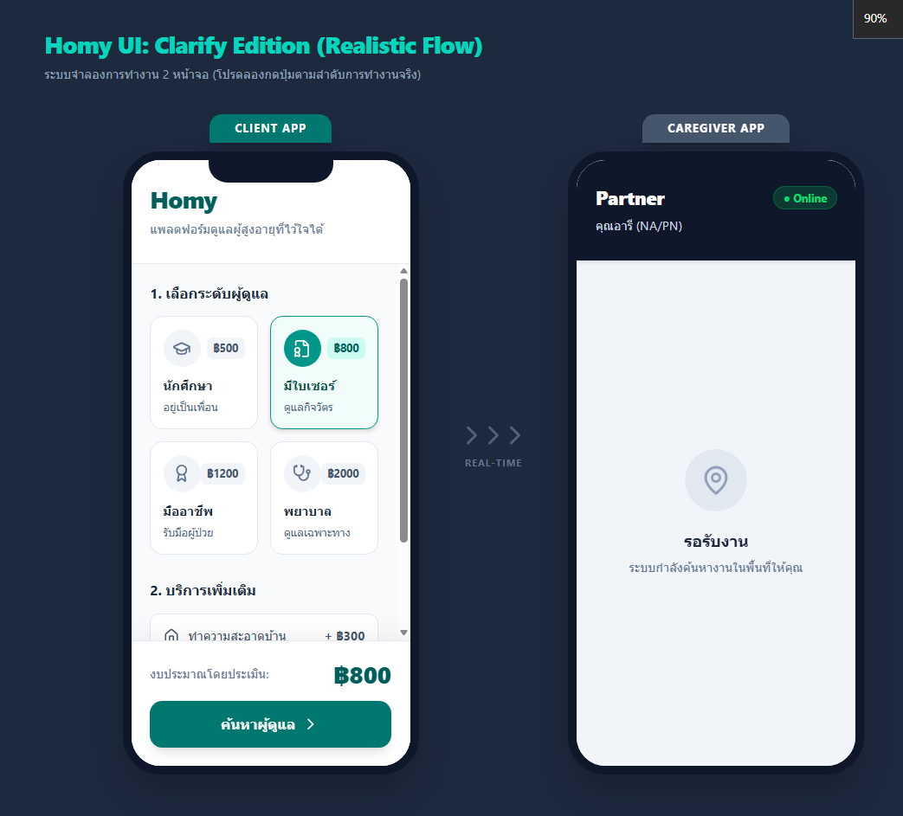

<div align="center">
  <h1>🏡 Homy Demo</h1>
  <p><strong>Elderly Care Service Platform - Realistic Flow Simulation</strong></p>
  

  <p><em>Homy is a reliable and safe platform designed to connect families with qualified elderly caregivers. This repository contains an MVP prototype simulating the real-time interactions between a Client and a Caregiver.</em></p>
</div>

## ✨ Overview

Homy solves the complex challenge of managing in-home elderly care by providing a transparent, secure, and real-time synchronized platform. This interactive demo showcases the **Dual-Screen Experience**, allowing the visitor to experience the workflow from both the **Client (Family)** perspective and the **Caregiver (Partner)** perspective simultaneously.

## 🚀 Key Features

- 📱 **Dual-Screen Simulation**: Experience the application flow side-by-side, watching state sync instantly between the Client and Caregiver interfaces.
- 🧑‍⚕️ **Tiered Caregiver Selection**: Flexible service levels based on elderly needs:
  - **Student**: Companionship and basic care.
  - **Certified (NA/PN)**: Daily routine assistance.
  - **Professional**: Bedridden patient handling.
  - **Registered Nurse (RN)**: Specialized medical care.
- 🔄 **Real-Time State Management**: Smooth transitions from requesting a caregiver, acceptance, checking-in, active duty, to checkout.
- 🕒 **Live Care Logging**: Caregivers can update their status instantly (e.g., Check-in, Giving medication, Uploading photos) forming a transparent timeline for the family.
- 🚨 **SOS Emergency Alerts**: Instant alert mechanism simulated to connect with 1669 (Emergency Medical Services) in case of critical situations.
- 💳 **Escrow Payment Concept**: Simulates secure fund holding to ensure peace of mind for both parties.

## 🛠️ Technology Stack

- **Framework**: [React 19](https://react.dev/) + [Vite](https://vitejs.dev/)
- **Styling**: [Tailwind CSS v4](https://tailwindcss.com/)
- **Icons**: [Lucide React](https://lucide.dev/)

## 💻 Getting Started

To run this simulation locally, follow these steps:

1. **Navigate to the project directory**:
   ```bash
   cd Homy-Demo
   ```

2. **Install dependencies**:
   ```bash
   npm install
   ```

3. **Start the development server**:
   ```bash
   npm run dev
   ```

4. **Visit the application**:
   Open your browser and navigate to `http://localhost:5173`.


<div align="center">
  <p>Built with ❤️ for accessible and reliable elderly care.</p>
</div>
